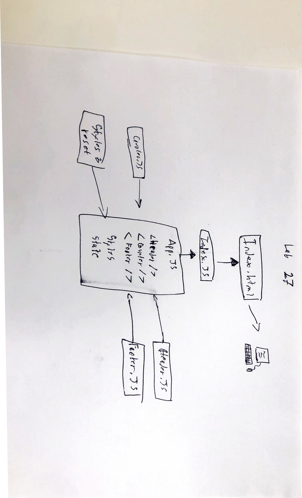

 LAB 27
=================================================

## React Testing and Deployment

### Author: Alexander White

### Links and Resources
* [Repo](https://github.com/alex-white-401-advanced-javascript/lab-27)
* [travis](http://xyz.com)
* [AWS Bucket](http://alex-white-401js-lab-27.s3-website-us-west-2.amazonaws.com)
* [AWS-yml](http://alexwhite401jslab27-alexwhite401d29lab27bucket-otjwmd9wfrt9.s3-website-us-west-2.amazonaws.com)
* [Netlify](https://jovial-kalam-415c85.netlify.com/)

#### Documentation
* [React Styleguidist]()

### Modules
#### `index.js`
Entry point for the React application. Requires React and React DOM as dependencies. Contains the `Main` React class component and renders `<App />`
Everything rendered through index.js is rended to the DOM in the `#root` div in `index.html`

#### `app.js`

##### `Counter` React class component. 
* Renders all components: `<Header>`, `<Counter />`, and `<Footer />`

#### `counter.js`
React class component containing logic and state for the counter
* `handleUp` takes in an event, prevents the page from relaoding, increments state.count by 1, and calls the `updateCounter` function
* `handleUp` takes in an event, prevents the page from relaoding, decrements state.count by 1, and calls the `updateCounter` function
* `updateCounter` takes in `count` passed to it by either `handleUp` or `handleDown` and performs a `.setState` to update the state.

#### `header.js`
React class component containing the header

#### `footer.js`
React class component containing the footer

#### `reset.scss`
Sass CSS reset styling for the application

#### `app.scss`
Sass CSS styling for the application.

### Setup

#### Running the app
* `npm start`
* Endpoint: `/`
  
#### Tests
* How do you run tests? `npm test`

### UML
